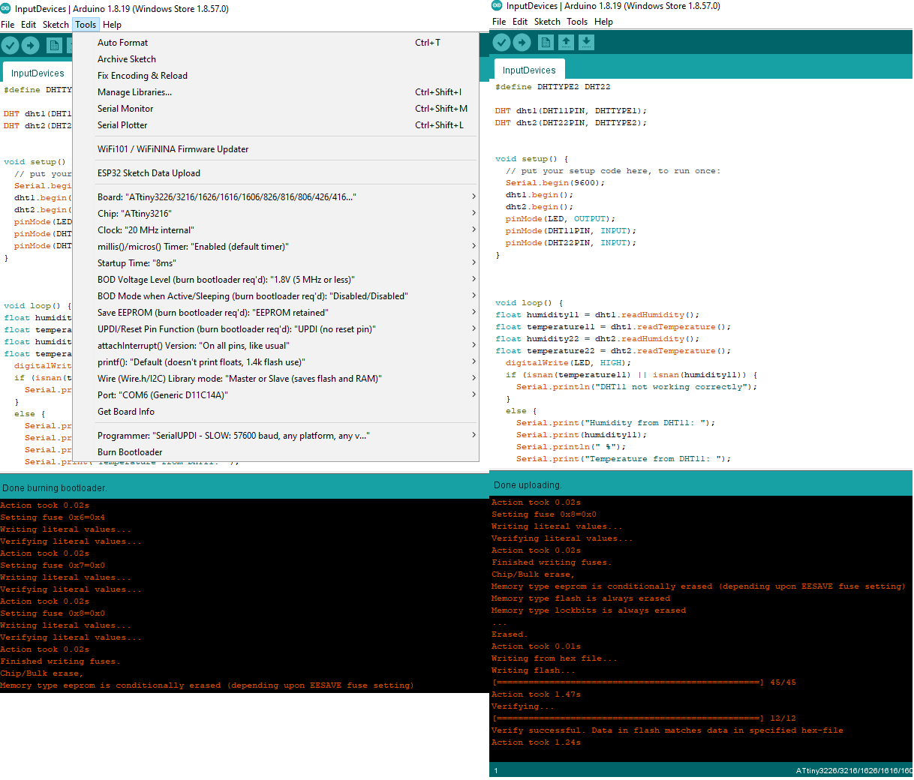

# ATTiny3216_developmentboard

A simple ATTiny3216 development board made with Kicad 6.0.

The board can be easily programmed with UPDI programmer such as this one: https://gitlab.fabcloud.org/pub/programmers/programmer-updi-d11c

Arduino IDE if using [megaTinyCore](https://github.com/SpenceKonde/megaTinyCore). 

Select from Tools:

Board: ATTiny3216
port: the SAMD11C14's serial port.
Programmer: SerialUPDI - SLOW

First burn the bootloader and then you are able to upload programs to it. Settings remain the same for both.

